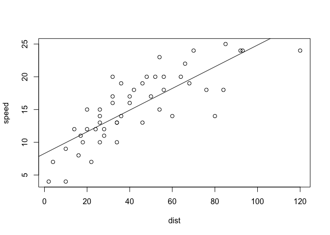

Hello World!
================
Vincent Alegrete
2024-12-21

See below for a basic linear model!

``` r
attach(cars)
model <- lm(speed ~ dist)
plot(speed ~ dist)
abline(model)
```

<!-- -->

We can even get the model summary!

``` r
summary(model)
```

    ## 
    ## Call:
    ## lm(formula = speed ~ dist)
    ## 
    ## Residuals:
    ##     Min      1Q  Median      3Q     Max 
    ## -7.5293 -2.1550  0.3615  2.4377  6.4179 
    ## 
    ## Coefficients:
    ##             Estimate Std. Error t value Pr(>|t|)    
    ## (Intercept)  8.28391    0.87438   9.474 1.44e-12 ***
    ## dist         0.16557    0.01749   9.464 1.49e-12 ***
    ## ---
    ## Signif. codes:  0 '***' 0.001 '**' 0.01 '*' 0.05 '.' 0.1 ' ' 1
    ## 
    ## Residual standard error: 3.156 on 48 degrees of freedom
    ## Multiple R-squared:  0.6511, Adjusted R-squared:  0.6438 
    ## F-statistic: 89.57 on 1 and 48 DF,  p-value: 1.49e-12

Does Latex work?

$$e=mc^2$$

Nice!
